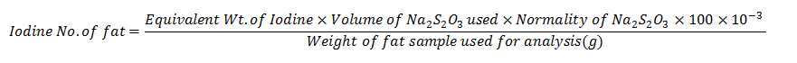

### Materials Required:

•    Iodine Monochloride Reagent

•    Potassium Iodide

•    Standardized 0.1 N Sodium thiosulphate

•    1% Starch indicator solution

•    Reagent bottle

•    Chloroform

•    Fat sample in chloroform

•    Iodination flask

•    Burette and burette stand with magnetic stirrer

•    Glass pipette

•    Measuring cylinder

•    Distilled water

&nbsp;

### Method:
 
 
&nbsp;

1.	Arrange all the reagent solutions prepared and the requirements on the table.

2.	Pipette out 10ml of fat sample dissolved in chloroform to an iodination flask labelled as “TEST".

3.	Add 20ml of Iodine Monochloride reagent in to the flask. Mix the contents in the flask thoroughly.

4.	Then the flask is allowed to stand for a half an hour incubation in dark.

5.	Set up a BLANK in another iodination flask by adding 10ml Chloroform to the flask.

6.	Add to the BLANK, 20ml of Iodine Monochloride reagent and mix the contents in the flask thoroughly.

7.	Incubate the BLANK in dark for 30 minutes.

8.	Meanwhile, Take out the TEST from incubation after 30 minutes and add 10 ml of potassium iodide solution into the flask.

9.	Rinse the stopper and the sides of the flask using 50 ml distilled water.

10.	Titrate the “TEST” against standardized sodium thiosulphate solution until a pale straw colour is observed.

11.	Add about 1ml starch indicator into the contents in the flask, a purple colour is observed.

12.	Continue the titration until the colour of the solution in the flask turns colourless.

13.	The disappearance of the blue colour is recorded as the end point of the titration.

14.	Similarly, the procedure is repeated for the flask labelled ‘Blank'.

15.	Record the endpoint values of the BLANK.

16.	Calculate the iodine number using the equation below:

        Volume of Sodium thiosulphate used  =  [Blank- Test] ml

    &nbsp;

            Equivalent Weight of Iodine = 127

            Normality of sodium thiosulphate ( Na2S203) = 0.1
