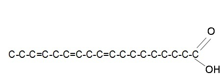
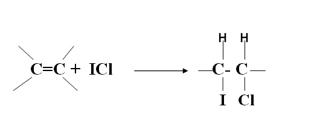

### Theory

&nbsp;

Fats and oils are a  mixture of triglycerids. Triglycerides are made up of three fatty acids linked to glycerol by fatty acyl esters. Fatty acids are long chain hydrocarbons with carboxyl groups (COOH groups). These fatty acids can be classified into saturated or unsaturated based on the number of double bonds present in the fatty acid. Saturated fatty acids contain only single bond between the carbon atoms and are tend to be solids at room temperature. Unsaturated fatty acids contain double bonds between the carbon atom in addition to the single bonds present in the fatty acid chain. They are likely to exists as liquids at room temperature. The double bonds present in the naturally occurring unsaturated fats are in the Cis form. Trans fatty acids are associated with health problems and cardiovascular diseases.

 
&nbsp;

Unsaturated fatty acids can be converted into saturated by the process of hydrogenation. Depending upon the degree of unsaturation, the fatty acids can combine with oxygen or halogens to form saturated fatty acids. So it is important to know the extend to which a fatty acid is unsaturated.  There are  different methods for checking the unsaturation level in fatty acids, one among them is by determining the iodine value of fats. Iodine value or number is the number of grams of iodine consumed by 100g of fat. A higher iodine value indicates a higher degree of unsaturation.

 fig: unsaturated fatty acids

&nbsp;

### Principle:

&nbsp;

Fatty acids react with a halogen [ iodine]  resulting  in the addition of the halogen at the C=C double bond site.  In this reaction, iodine monochloride  reacts with the unsaturated bonds to produce a di-halogenated single bond, of which one carbon has bound an atom of iodine.

&nbsp;

After the reaction is complete, the amount of iodine that has reacted is determined by adding a solution of potassium iodide to the reaction product.

        ICl + KI   --------------->   KCl + I2

 

&nbsp;

 This causes the remaining unreacted ICl to form molecular iodine. The liberated  I2 is then titrated with a standard solution of 0..1N sodium thiosulfate.

 

        I2 + 2 Na2S2O3  ----------------->   2 NaI + Na2S2O4

 

&nbsp;

Saturated fatty acids will not give the halogenation reaction.  If the iodine number is between 0-70, it will be  a fat and if the value exceeds 70  it is an oil. Starch is used as the indicator for this reaction so that the liberated iodine will react with starch to give purple coloured product and thus the endpoint can be observed.